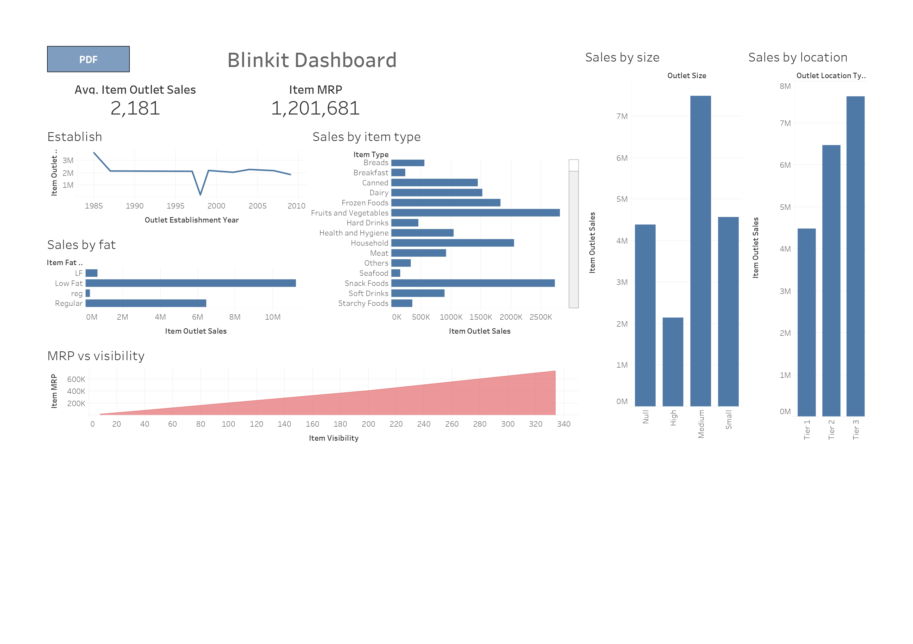
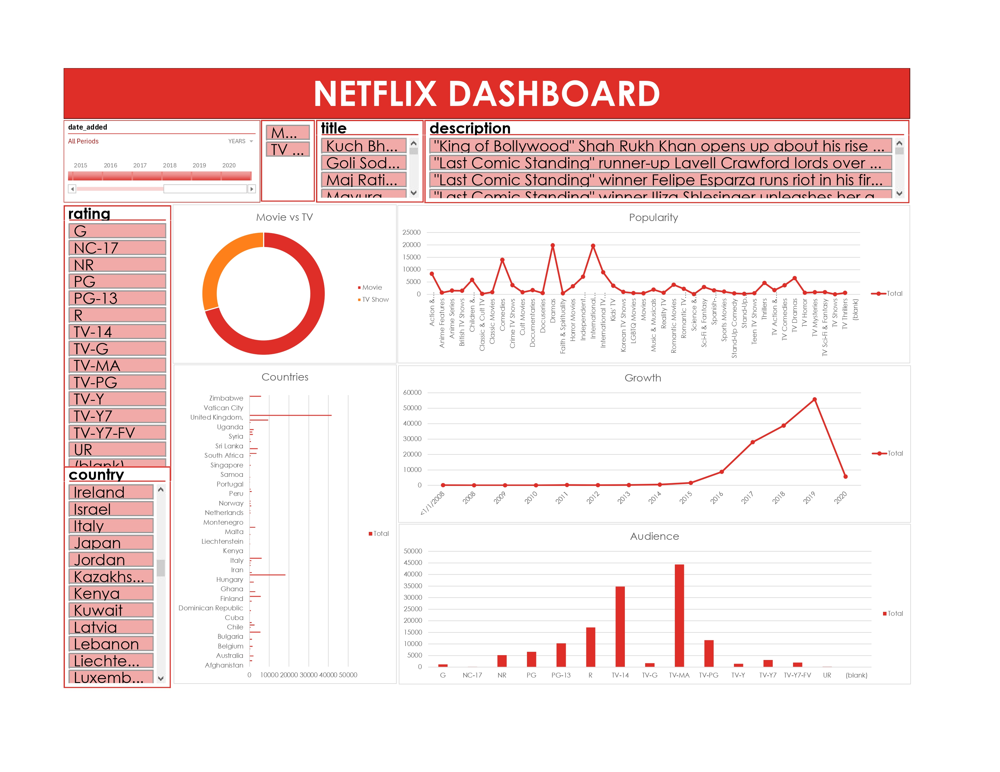

# Data Science Dashboards

This repository contains data visualization projects analyzing retail and entertainment datasets to transform raw data into actionable business insights.

## 1. Blinkit Grocery Sales Analysis

This dashboard focuses on the sales performance and outlet efficiency of a grocery retail chain.

### Analysis Focus
* **KPI Metrics:** Track Total Sales, Average Sales, and Total Item Count.
* **Sales by Location:** Analyze revenue distribution across Tier 1, Tier 2, and Tier 3 cities.
* **Outlet Performance:** Evaluate how store size and establishment year impact the bottom line.
* **Product Segmentation:** Compare sales performance across different item types and fat content.

---

## 2. Netflix Content Strategy

This project analyzes the Netflix library to understand content acquisition trends and audience demographics.

### Analysis Focus
* **Content Mix:** Visualize the distribution between Movies and TV Shows.
* **Library Growth:** Track the volume of content added annually (2008–2020).
* **Audience Analysis:** Categorize content by age-based ratings (TV-MA, PG-13, TV-14) to identify demographics.
* **Geographic Trends:** Map title counts by country to show global sourcing.

## Technical Summary

* **Tools Used:** Tableau, Microsoft Excel
* **Data Sources:** Included in the repository
* **Key Features:** Interactive slicers for years, ratings, and content types
